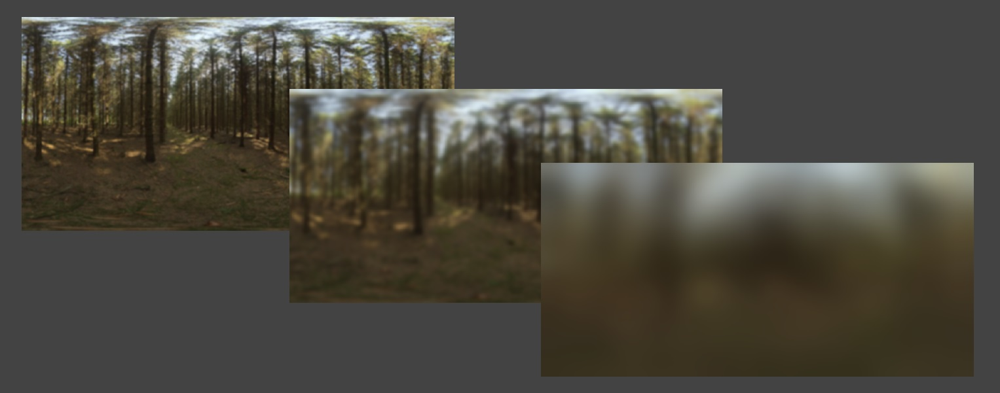
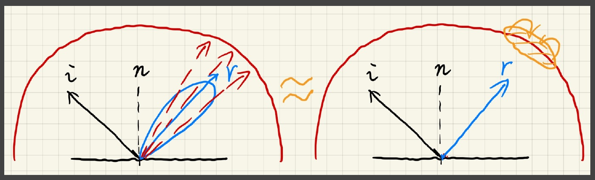

## 环境映射 (Environment Mapping)

**假设**: 1. 环境光照无限远 2. 不考虑遮挡
**存储方式**： 1. spherical map 2. cube map

### 1 环境光着色

**环境光着色 (Shading from Environment Lighting)** 又称 Image-Based Lighting (IBL)

我们的问题就是如何解关于E环境光照的渲染方程:

$$
L_{o}(p, \omega_{o}) = \int_{\Omega^{+}}L_{i}(p, \omega_{i})f_{r}(p, \omega_{i}, \omega_{o}) \cos{\theta_{i}}d\omega_{i}
$$

#### 1.1 观察

- BRDF is glossy —— 积分域小 (small support)
- BRDF is diffuse —— smooth integrand

#### 1.2 近似方法

BRDF无论是glossy还是diffuse都能满足这条近似公式：
$$
\int_{\Omega} f(x)g(x)dx  \approx \frac{\int_{\Omega_{G}} f(x)dx}{\int_{\Omega_{G}} dx} \cdot \int_{\Omega_{G}}g(x)dx \quad (1)
$$

$$
L_{o}(p, \omega_{o}) \approx \frac{\int_{\Omega_{f_{r}}} L_{i}(p, \omega_{i})d\omega_{i}}{\int_{\Omega_{f_{r}}}d\omega_{i}} \cdot \int_{\Omega+} f_{r}(p, \omega_{i}, \omega_{o}) \cos{\theta} d\omega_{i} \quad (2)
$$

首先我讲光照计算部分拆出来得到**公式(2)**。

因此，我们可以将环境贴图用一定大小的卷积核做卷积（模糊），如下图所示：

下图对**公式(2)** 做了一个直观的解释：

接下来，我们还需要对**公式(2)** 的右半部分进行拆分求解(假设这个BRDF是微表面材质):
$$
\int_{\Omega+} f_{r}(p, \omega_{i}, \omega_{o}) \cos{\theta_{i}} d\omega_{i} \approx R_{0} \int_{\Omega+} \frac{f_{r}}{F}(1-(1-\cos{\theta_{i}})^{5})\cos{\theta_{i}} d\omega_{i} \\ + \int_{\Omega+} \frac{f_{r}}{F} (1 - \cos{\theta_{i}})^{5}\cos{\theta_{i}} d\omega_{i}
$$

#### 

### 2 环境光阴影

在实时渲染中环境光生成阴影非常困难。因此，解决方法就是生成最亮光源投射的阴影

#### 2.1 为什么难
- 看作一个**多光源(many-light)** 问题: 需要n个Shadow Map
- 看作一个采样问题: 1. 对于着色点，采样样本数量要求高 2. 无法将Visibility term从渲染方程中拆分出来

#### 2.2 Related research

- Imperfect shadow maps
- Light cuts
- RTRT
- **Precomputed radiance transfer(PRT)**

### 3 PRT

可以解决环境光着色阴影以及全局光照(global illumination)的问题。PRT的问题是，场景中只有环境光可以动。

