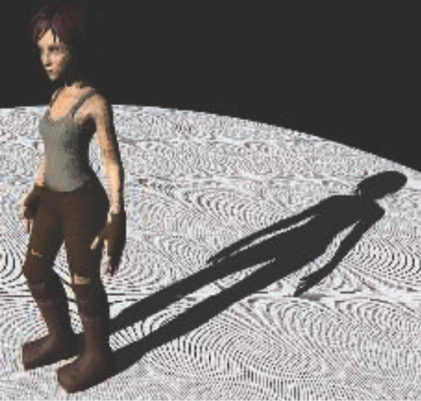
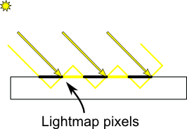
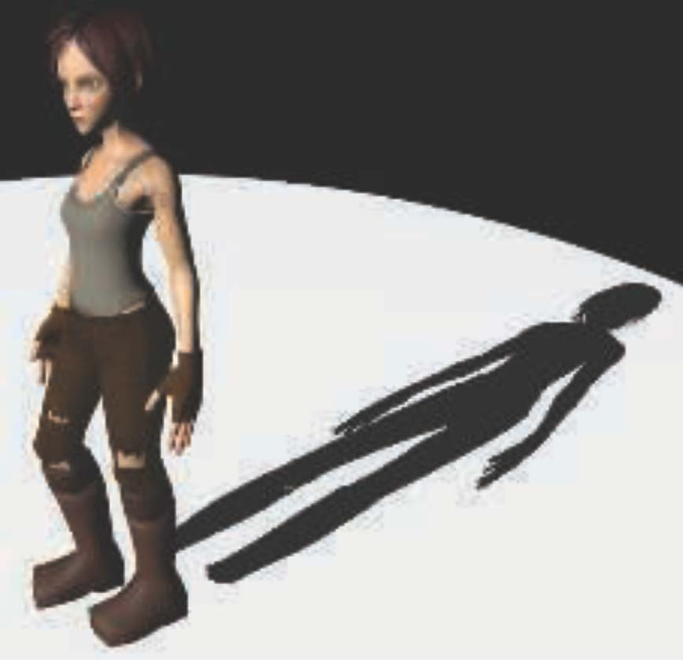
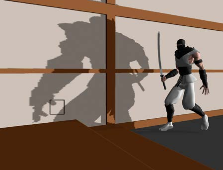
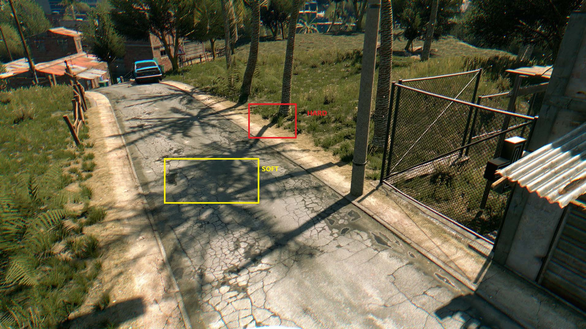
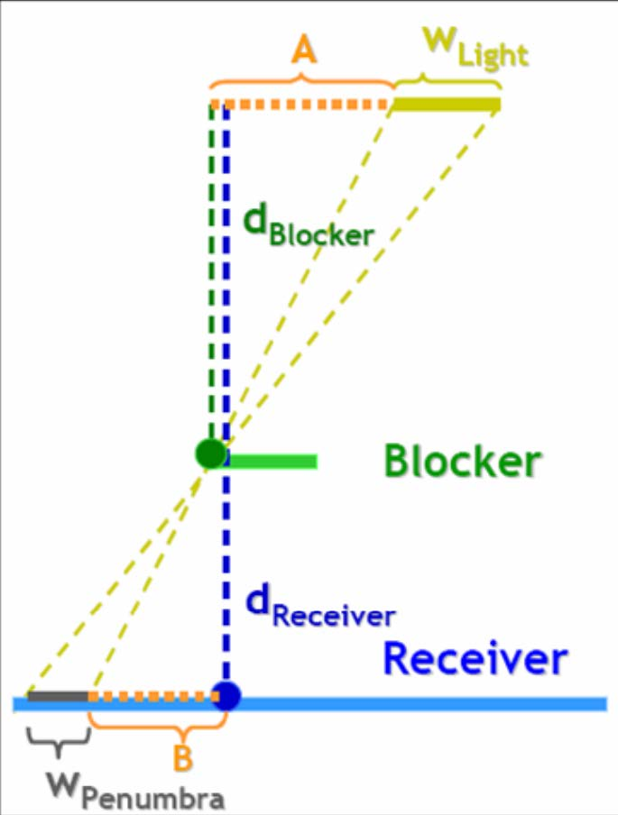
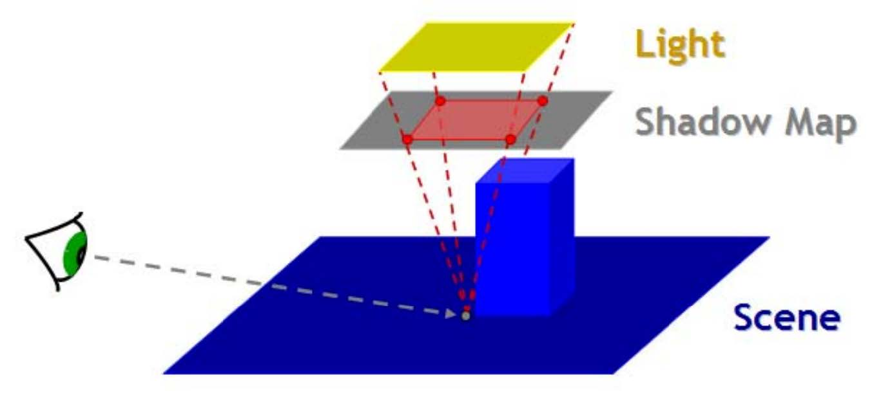

## 1 Shadow Mapping

两次PASS:
- Pass1: 在光源处建立MVP矩阵(记作, LightMVP)，将场景中的物体变换到**光源空间中**，记录其深度值到提前创建好的FrameBuffer(记作，LightBuffer)中。（存储最近物体的深度值）
- Pass2: 将场景中所有的fragment通过LightMVP变换到光源空间中。将fragment在LightBuffer中对应的位置的深度值进行比较，计算Visibility结果。

## 2 Self Occlusion



### 2.1 WHY



如上图所示，Lightmap精度不足，Lightmap的一个**纹素**往往包含了多个像素，并且形成一定角度。

### 2.2 Bias

设置一个固定的bias，方可解决

```glsl
float closestDepth = texture2D(shadowMap, shadowCoord.xy).r;
float bias = 0.005;
float visibility = currentDepth - bias > closestDepth ? 0.0 : 1.0;
```

### 2.3 Peter Panning



虽然我们通过设置bias解决了self occlusion问题，但是通过上图发现，我们有一段阴影消失了。**但是，这个问题在工业界并没有完全被解决**。在[opengl-tutorial#peter-panning](http://www.opengl-tutorial.org/intermediate-tutorials/tutorial-16-shadow-mapping/#peter-panning)中提供了一种方法，则是在Pass1之前设置backface culling。

### 2.4 Auto Bias

通过lightDir与normal的夹角获取自适应的bias

```glsl
float bias = max(0.005 * (1.0 - dot(normal, lightDir)), 0.0001);
```

## 3 PCF(Percentage Closer Filtering)



为了解决硬阴影带来的aliasing的问题，我们需要做抗锯齿。

**PCF(Percentage Closer Filtering)** ：
- 通过采取shading point周围的lightmap depth与其深度比较，得到一系列的0 or 1的结果。
- 将这些结果相加并除以采样次数，得到一个[0, 1]范围内的visibility

### 3.1 Poission Sampling 

## 4 PCSS(Percentage Closer Soft Shadow)



这是个Dying Light的例子，可以看到PCSS在**遮挡物近处呈现的是硬阴影，而远处呈现的是软阴影**。基于这样的现象，我们可以根据遮挡物与接受体的距离来计算PCF的filter size。

### 4.1 Algorithm



$$
w_{penumbra} = (d_{receiver} - d_{blocker}) \cdot w_{light} / d_{receiver}
$$

- step 1: 计算blocker平均深度
- step 2: 计算penumbra
- step 3: 将penumbra作为filtersize传入到PCF中进行计算visibility

### 4.2 Detail



在step1中，我们需要注意俩处细节：
- 通过相似关系得到light map的search width
- 如果确认边缘的search width需要特殊处理

## 5 other

### 5.1 VSSM(Variance Soft Shadow Mapping)

作为一种加速PCSS的方法，但会产生Light leaking的问题

### 5.2 Moment Shadow Mapping

解决VSSM的Light leaking问题

## 6 数理来源

$$
L_{o}(p, \omega_{o}) = \int_{\Omega+} L_{i}(p, \omega_{i}) f_{r}(p,\omega_{i}, \omega_{o}) \cos{\theta_{i}} V(p, \omega_{i})d\omega_{i} \\
$$
$$
L_{o}(p, \omega_{o}) \approx \frac{\int_{\Omega+}V(p, \omega_{i})d\omega_{i}}{\int_{\Omega+}d\omega_{i}}\int_{\Omega+} L_{i}(p, \omega_{i}) f_{r}(p,\omega_{i}, \omega_{o})\cos{\theta_{i}} d\omega_{i}
$$

## Reference

1. Shadow mapping. http://www.opengl-tutorial.org/intermediate-tutorials/tutorial-16-shadow-mapping
2. Integrating Realistic Soft
Shadows into Your Game
Engine. https://developer.download.nvidia.com/whitepapers/2008/PCSS_Integration.pdf